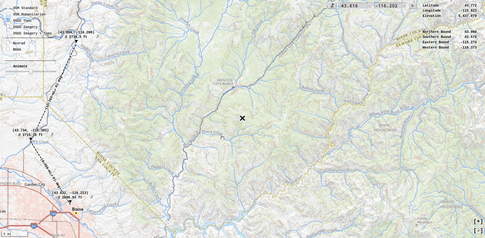
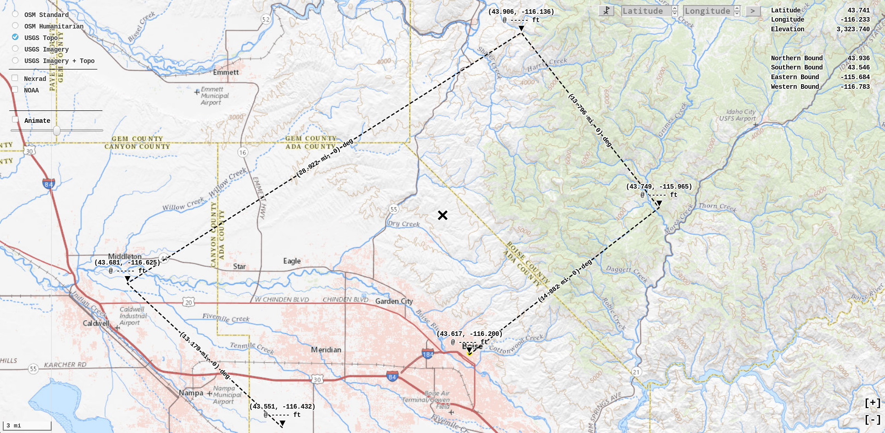
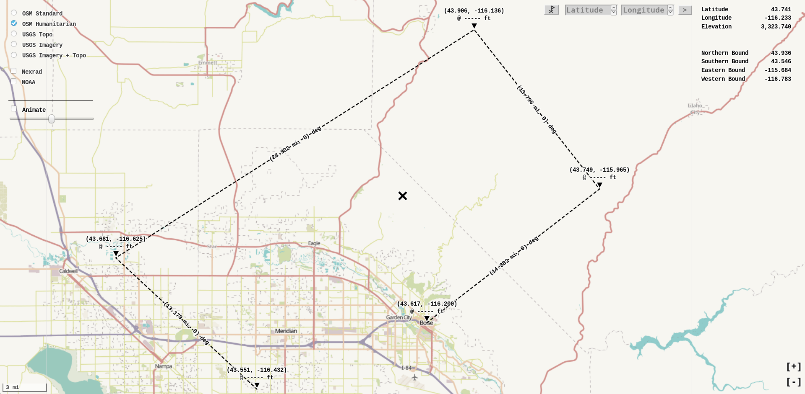
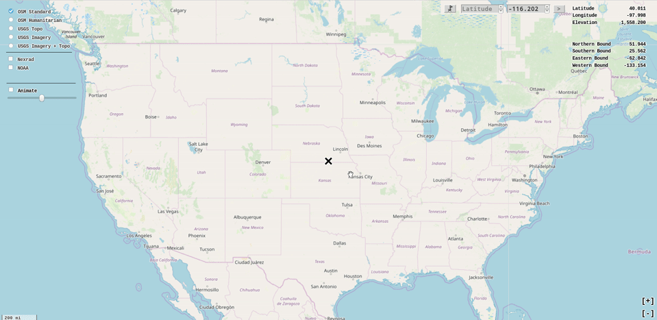
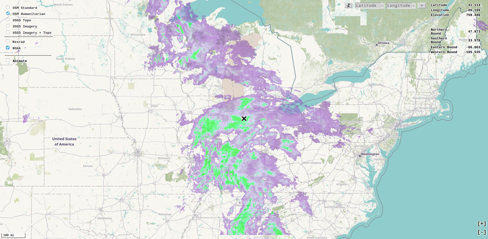
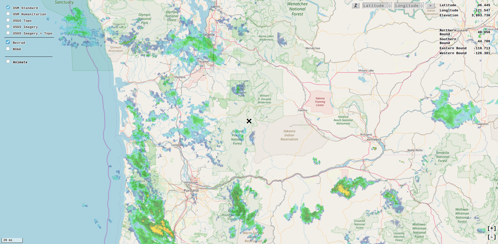
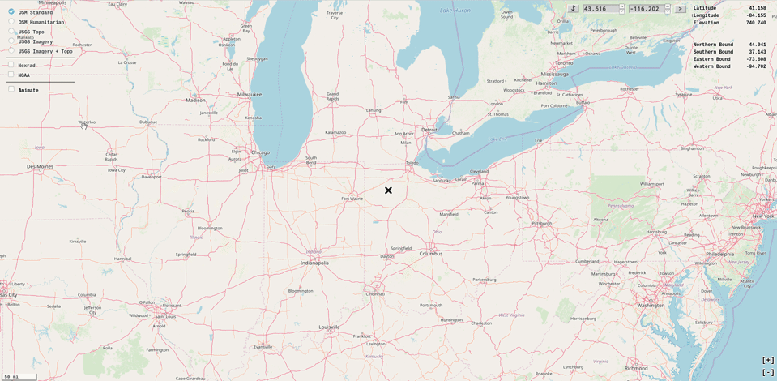

# Klerde (Klima + Erde) [Demo](https://rwev.github.io/klerde/)
Pure TypeScript application for quick and dirty map measurements useful for outdoor terrain navigation. Relies on public and open sources, including USGS maps and elevation data, Nexrad and NOAA satellite weather, and OSM. 













## Build 

Packages and tasked are managed with NPM, node package manager. To build, run
```shell
/klerde $ npm i && npm run build
```

This transpiles the TypeScript source and bundles it with JavaScript dependencies using webpack. 

Then, open the webpage with a web browser.
```shell
/klerde $ firefox ./index.html
```

## Development 

Global installations
```shell
$ sudo npm i -g cordova
```


